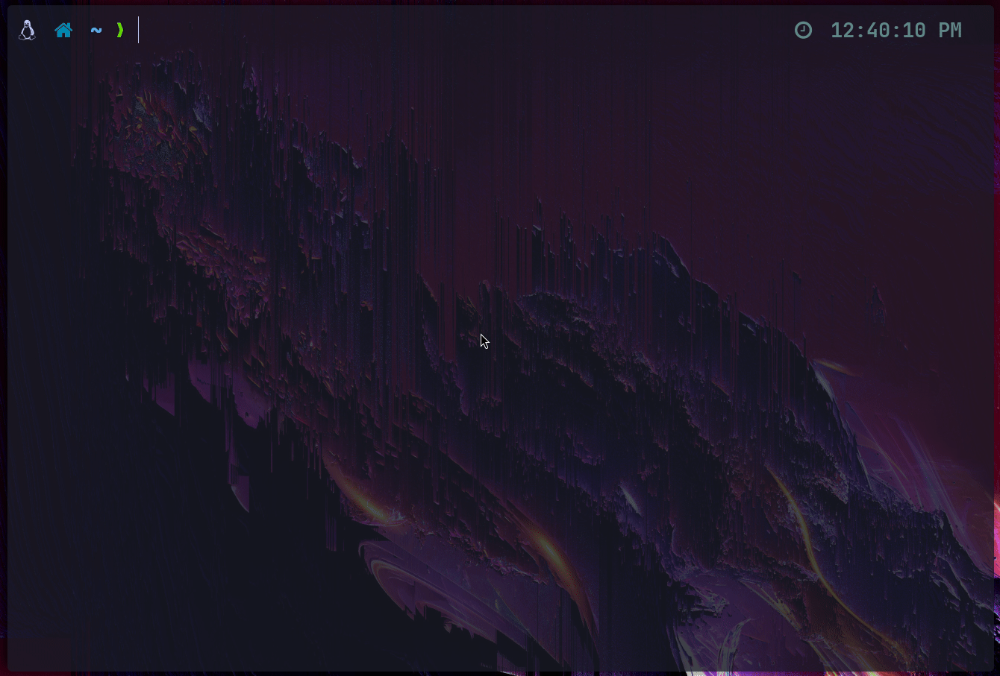

# Writing interpreter in go
This is for people who love to look under the hood to see how things are made!. For people that love love to learn by understanding how somthing really works.

In this project, we're going to write our own interpreter for our own programming language (from scratch). No 3rd party tools or libraries are going to be used!

Notes: The aim of the project is to learn, not going to have the performance of a fully-fledged interpreter, nor the best features.

## Progress

A Demo of some of the features I have implemented so far.
- Numbers: `let x = 20`
- Lists: `let x = [69, 420]`
- Strings: `let x = "Hello, darkness my old friend"`
- Functions, closures, First-class and Higher-order functions : `let x = fn(a, b) { a + b }`
- Some built-in functions (for now, not many): `len, exit`
- Assignments: `x = 10; arr[0] = 20`



## Tree-Walking interpreter
An interpreter that parse the source code, build an abstract syntx tree (AST) out of it and then evaluate the tree.

we're going to build our own lexer, parser, tree representation and evaluator.

## The programming language
every interpreter is built to interpret a specific programming language. Without a compiler or an interpreter a programming language is nothing more than an idea or a specification.

The language we're going to build is going to be called : Monkey!
The features of The Monkey Programming Language:
- C-like syntax
- variable bindings
- integers and booleans
- arithmetic expressions
- built-in functions
- first-class and higher-order functions
- closures
- data sturctures : [strings, arrays, hash data]

## Roadmap
The interpreter we’re going to build in this book will implement all these features. It will
tokenize and parse Monkey source code in a REPL, building up an internal representation of
the code called abstract syntax tree and then evaluate this tree. It will have a few major parts:
- the lexer
- the parser
- the Abstract Syntax Tree (AST)
- the internal object system
- the evaluator
### Lexer 
### Parser 
#### Parsing let statements

Expressions produce values, statements don’t. `let x = 5` doesn’t produce a value,
whereas 5 does (the value it produces is 5). A return 5; statement doesn’t produce a value,
but add(5, 5) does. This distinction - expressions produce values, statements don’t - changes
depending on who you ask, but it’s good enough for our needs

Here's a fully valid let example:

```javascript
    let x = 10;
    let y = 15;
    let add = fn(a, b) {
    return a + b;
    };
```

#### Parsing return statements

```javascript
    return 5;
    return 10;
    return add(15);
```
Experienced with let statements, we can easily spot the structure behind these statements:
return <expression>;

Return statements consist solely of the keyword return and an expression. That makes the
defnition of `ast.ReturnStatement` really simple.

#### Parsing Expressions

- [X] Expressions involving prefx operators:
```js
    -5
    !true
    !false
```
- [X] And of course it has infx operators (or “binary operators”):
```js
    5 + 5
    5 - 5
    5 / 5
    5 * 5
```
- [X] Besides these basic arithmetic operators, there are also the following comparison operators:
```js
    foo == bar
    foo != bar
    foo < bar
    foo > bar
```
- [X] And of course, we can use parentheses to group expressions and influence the order of evaluation:
```js
    5 * (5 + 5)
    ((5 + 5) * 5) * 5
```
- [X] Then there are call expressions:
```js
    add(2, 3)
    add(add(2, 3), add(5, 10))
    max(5, add(5, (5 * 5)))
```
- [X] Identifers are expressions too:
```js
    foo * bar / foobar
    add(foo, bar)
```
- [X] Function literals are expressions too. We can use a let statement to bind a function to a name. The function literal is just the expression in the statement:
```js
    let add = fn(x, y) { return x + y };
```
- [X] And here we use a function literal in place of an identifer:

```js
fn(x, y) { return x + y }(5, 5)
(fn(x) { return x }(5) + 10 ) * 10
```
- [X] In contrast to a lot of widely used programming languages we also have “if expressions”:
```
let result = if (10 > 5) { true } else { false };
result // => true
```
